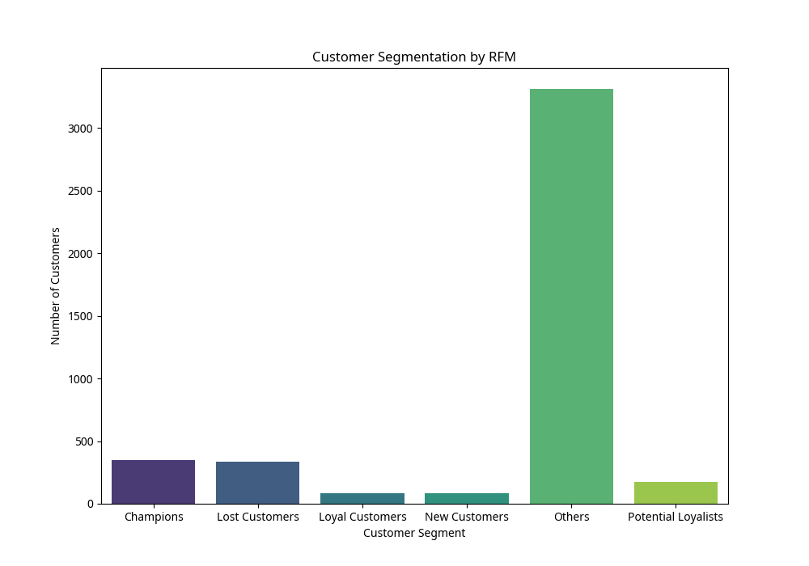

# E-commerce RFM Customer Segmentation Report

## Title Page

**Project Title:** E-commerce RFM Customer Segmentation

**Author:** Lungelo Sigudla

**Date:** [Removed for clarity]

## Executive Summary

In this report, I detail the process and results of a customer segmentation analysis I performed on the Online Retail dataset. Using the RFM (Recency, Frequency, Monetary) model, I segmented customers into distinct groups based on their purchasing behavior. My analysis identified several key customer segments, including "Champions," "Loyal Customers," "Potential Loyalists," "New Customers," and "Lost Customers." These segments provide valuable insights for developing targeted marketing strategies, improving customer retention, and maximizing customer lifetime value. The findings from this project can help the e-commerce business tailor its marketing efforts to specific customer groups, leading to more effective campaigns and increased profitability.

## Project Goal

My primary goals for this project were to:

1.  Perform customer segmentation using the RFM (Recency, Frequency, Monetary) analysis technique.
2.  Identify distinct customer segments based on their transaction history.
3.  Provide actionable insights and recommendations for targeted marketing strategies for each customer segment.

## Data Source & Acquisition

The dataset used for this analysis is the **Online Retail** dataset from the UCI Machine Learning Repository (https://archive.ics.uci.edu/dataset/352/online+retail). This is a transactional dataset containing all the transactions occurring between 01/12/2010 and 09/12/2011 for a UK-based and registered non-store online retail.

The dataset was downloaded directly from the UCI repository.

## Data Preparation and Tools

**Tools Used:**

*   **Python:** For data loading, cleaning, analysis, and visualization.
*   **Pandas:** For data manipulation and analysis.
*   **Matplotlib & Seaborn:** For creating data visualizations.

**Data Preparation Steps:**

1.  **Loading Data:** The `Online Retail.xlsx` file was loaded into a Pandas DataFrame.
2.  **Data Cleaning:**
    *   Rows with missing `CustomerID` were removed.
    *   Rows with negative `Quantity` (representing returns) were filtered out.
3.  **Feature Engineering:** A `TotalPrice` column was calculated by multiplying `Quantity` and `UnitPrice`.
4.  **Data Transformation:** The `InvoiceDate` column was converted to a datetime object.

## Dashboards Walkthrough

### Customer Segmentation by RFM

This bar chart visualizes the distribution of customers across the different RFM segments. It provides a clear overview of the size of each customer group, helping to prioritize marketing efforts.

## Insights

1.  **Champions:** These are the most valuable customers who have purchased recently, frequently, and have spent the most. They are the bedrock of the business.
2.  **Loyal Customers:** These customers buy frequently and have high monetary value but may not have purchased very recently. They are at risk of churning.
3.  **Potential Loyalists:** These are recent customers with average frequency and monetary value. They have the potential to become loyal customers with the right engagement.
4.  **New Customers:** These are customers who have made their first purchase recently. They are a crucial group to nurture for future growth.
5.  **Lost Customers:** These customers have not purchased in a long time and have low frequency and monetary value. It may be costly to try and win them back.

## Recommended Actions

1.  **Champions:**
    *   Reward them with exclusive offers, early access to new products, and loyalty programs.
    *   Seek their feedback and testimonials to build social proof.
2.  **Loyal Customers:**
    *   Re-engage them with personalized marketing campaigns and special promotions.
    *   Remind them of their value to the business.
3.  **Potential Loyalists:**
    *   Encourage repeat purchases with incentives and personalized recommendations.
    *   Provide excellent customer service to build a strong relationship.
4.  **New Customers:**
    *   Onboard them with a welcome series of emails or messages.
    *   Provide them with information about the brand and products to encourage their next purchase.
5.  **Lost Customers:**
    *   Consider a win-back campaign with a special offer, but be mindful of the cost.
    *   Focus on understanding why they churned to prevent future customer loss.

## Challenges

## Conclusion

RFM analysis is a powerful and intuitive method for customer segmentation. By dividing customers into meaningful groups based on their purchasing behavior, businesses can develop more effective and personalized marketing strategies. The insights and recommendations from this project provide a clear roadmap for the e-commerce business to enhance customer relationships, increase customer lifetime value, and drive sustainable growth.

